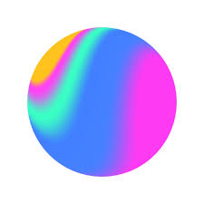

# OSCORP - Immersive Landing Page

A sleek, futuristic landing page designed to deliver an immersive user experience through smooth animations and a stunning 3D model integration.

---

## Demo

Check out the live demo here: [Landing Page!🤖](https://dshivam9.github.io/Immersive-Landing-Page/)

---

## Features

- **Smooth scroll animations** powered by [AOS (Animate On Scroll)](https://michalsnik.github.io/aos/)  
- **3D interactive model** embedded with [Spline Viewer](https://spline.design/) for a dynamic visual experience  
- Responsive layout with clean, modern UI styling  
- Custom gradient animations and hover effects  
- Easy to customize for branding or content changes

---

## 🚀 Tools & Technologies

Here are the main tools and technologies I used to build this immersive landing page:

| Tool / Language | Logo |
|-----------------|------|
| HTML5           |  |
| CSS3            |  |
| Spline          |  |

---

## Installation & Usage

1. Clone this repository  
   ```bash
   git clone https://github.com/yourusername/oscorp-landing-page.git
